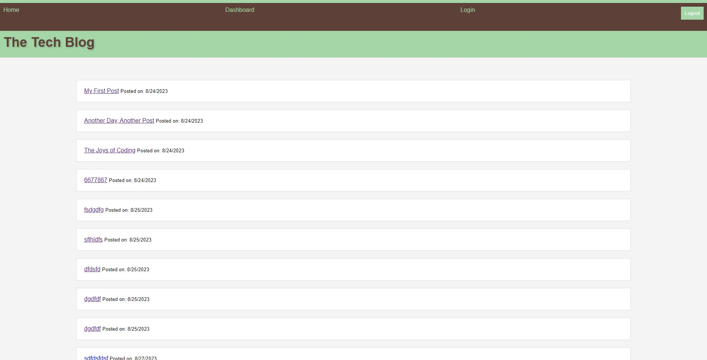

# Tech Blog

## Description

This is a Tech Blog web application where users can create, edit, and delete their own blog posts. Users can also comment on posts and engage in discussions. The application is built using Node.js, Express.js, Handlebars, and Sequelize ORM.

The site can be accessed [here](https://github.com/jonesmatr/Tech-Blog.git).

 

## Table of Contents

1. [Installation](#Installation)
2. [Usage](#Usage)
3. [Features](#Features)
4. [Contributing](#Contributing)
5. [License](#License)

## Installation

1. Clone the repository to your local machine.
2. Run `npm install` to install all the dependencies.
3. Set up your `.env` file with your MySQL database information.
4. Run `npm run seed` to seed the database.
5. Run `npm start` to start the application.

## Usage

1. Open the application in your browser.
2. Register or log in to your account.
3. Create, edit, or delete posts.
4. Comment on posts.

## Features

- User Authentication
- CRUD Operations for Posts
- Commenting on Posts
- User Dashboard

